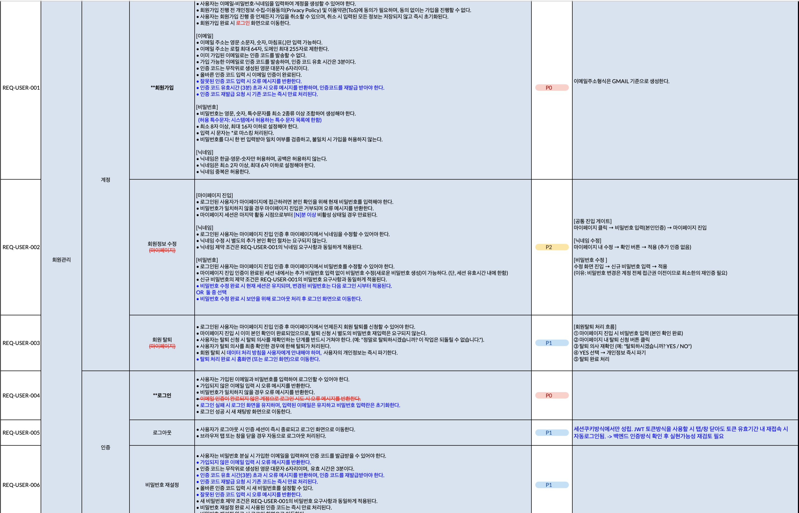
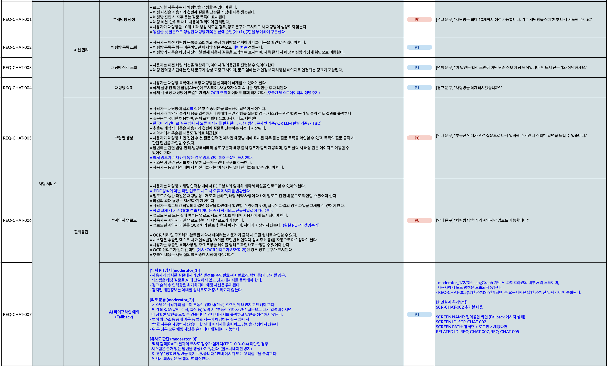
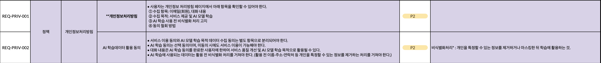
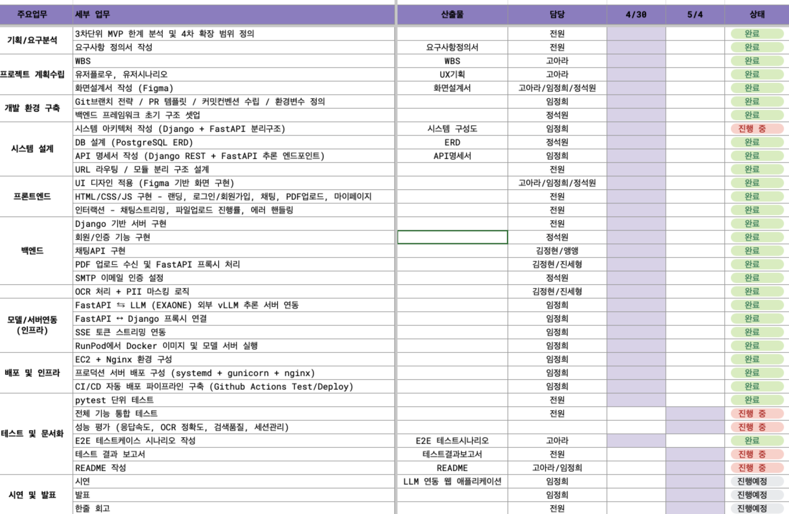
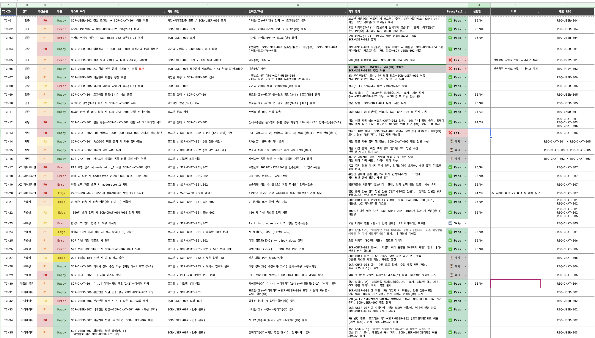
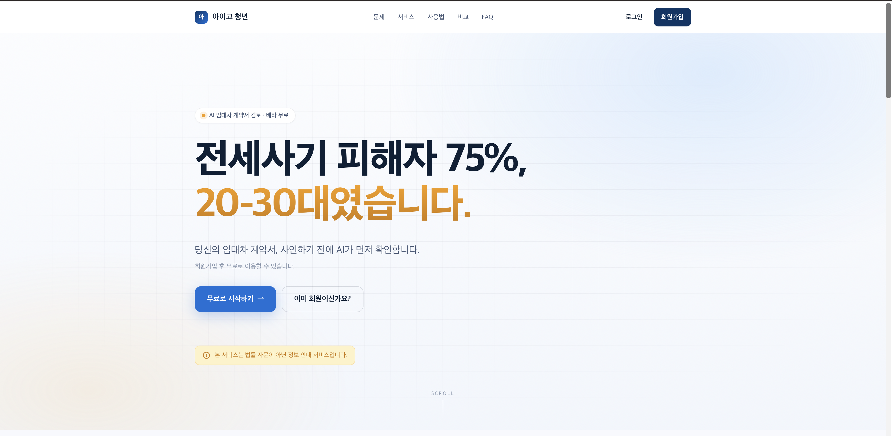

# 🏠 아이고 청년 (Aigo Youth) — AI 기반 임대차 계약서 검토 웹 서비스

**AI 기반 임대차 계약서 검토 서비스 플랫폼**

> [SKN24 4차 프로젝트] 4차 단위 프로젝트 — 3차 LLM RAG 챗봇(Streamlit MVP)을 **Django + FastAPI 기반 웹 서비스**로 확장

---

## 1. 팀 소개

### 팀명

> **아이고 청년 (Aigo-youth)**

### 팀원

| 이름   | GitHub                                              |
| ------ | --------------------------------------------------- |
| 고아라 | [Akoh-0909](https://github.com/Akoh-0909)           |
| 김정현 | [Jeich-16](https://github.com/Jeich-16)             |
| 진세형 | [gugu-eightyone](https://github.com/gugu-eightyone) |
| 임정희 | [bigmooon](https://github.com/bigmooon)             |
| 정석원 | [JeongSW123](https://github.com/JeongSW123)         |

---

## 2. 프로젝트 개요

### 2-1. 프로젝트 소개

부동산 임대차 계약은 보증금, 특약, 계약 기간 등 꼼꼼히 따져야 할 내용이 많지만, 법률 지식이 부족한 사회 초년생이나 일반 임차인이 스스로 모든 정보나 내용을 파악하기는 쉽지 않습니다.

**아이고 청년**은 사용자가 임대차 계약 관련 상황이나 궁금증을 자연어로 질문하면, **법령·판례·법령해석례를 검색하여 근거 기반으로 답변**하는 RAG(Retrieval-Augmented Generation) 기반 웹 서비스입니다.

본 4차 단위 프로젝트에서는 3차 단위에서 구현한 Streamlit 기반 RAG 챗봇 MVP를 **Django + FastAPI 분리 아키텍처 기반의 웹 서비스로 확장**하였으며, **회원 시스템, PDF 계약서 업로드 + OCR 텍스트 추출, 개인정보(PII) 자동 마스킹** 등 실서비스 운영에 필요한 기능을 추가 구현하였습니다.

> ⚠️ **본 서비스는 법률 자문이나 법적 조언을 제공하는 서비스가 아닙니다.**
>
> 법령·판례·법령해석례에 기반한 정보 안내 서비스이며, 구체적인 법적 판단이 필요한 경우 반드시 전문가와 상담하시기 바랍니다.

---

### 2-2. 배경 및 필요성

#### 사회적 배경

전세사기 피해가 사회적 문제로 대두되었으며, **20~30대 청년층이 전체 피해의 약 75%**를 차지했습니다. 피해의 주요 원인은 **계약 전 위험 조항 미인지**와 **특약 내용에 대한 법적 효력 무지**입니다.

**전세사기 피해자 연령 분포 (2025.05 기준)**

| 연령대    | 피해자 수       |   비율   |
| :-------- | :-------------- | :------: |
| 20대      | 7,854명         |  25.8%   |
| 30대      | 14,983명        |  49.3%   |
| 40대      | 4,240명         |  13.9%   |
| 50대 이상 | 3,323명         |  11.0%   |
| **전체**  | **약 30,400명** | **100%** |

> 20~30대 청년층이 전체 피해의 **75.1%**를 차지

**출처**: 국토교통부, [전세사기 피해 실태조사 결과](https://www.molit.go.kr/USR/NEWS/m_71/dtl.jsp?lcmspage=1&id=95091032)

#### 핵심 문제

임대차 계약서에는 임차인에게 일방적으로 불리한 특약이 포함되는 경우가 많지만, **법률 지식이 부족한 일반인이 계약 전에 이를 직접 파악하기는 매우 어렵습니다**. 또한 일반인이 법령·판례·법령해석례를 직접 찾아보기도 쉽지 않으며, 변호사·법무사 상담은 비용 부담이 큽니다.

→ 이러한 정보 비대칭과 접근성 문제가 청년층의 전세사기 피해로 이어지고 있습니다.

---

### 2-3. 기존 서비스의 한계

| 서비스                         | 운영 주체         | 핵심 기능                           | 한계                                                       |
| ------------------------------ | ----------------- | ----------------------------------- | ---------------------------------------------------------- |
| **전세사기 위험분석 보고서**   | 서울시 + 내집스캔 | 주소 입력 → 집주인·주택 위험도 점수 | 계약 내용·특약 분석 불가 / 서울 청년 한정 / 쿠폰 수량 제한 |
| **AI 기반 거래 안전망 솔루션** | 경기도 + NIA      | 주소 입력 → 등기부·시세·근저당 분석 | **2026년 하반기 시범운영 예정, 현재 미출시** / 경기도 한정 |
| **앨리비**                     | BHSN              | AI 계약서 검토·관리                 | B2B 기업 법무팀 대상 유료 구독 / 임대차 특화 없음          |

→ **임대차 계약/특약 내용을 법령·판례 근거로 조항을 분석해주고 질의응답할 수 있는 일반인 대상의 무료 B2C 서비스는 현재 존재하지 않습니다.**

---

### 2-4. 프로젝트 목표 및 차별성

#### 🔍 국내 AI 계약 검토 서비스 현황 및 차별성

💡**서비스 포지셔닝**:
현재 상용화된 서비스들은 **주소 기반의 위험도 분석**이나 **B2B 범용 계약 검토**에 치중되어 있습니다.
본 프로젝트는 **임대차 계약서 내용과 특약**을 법령·판례 근거로 질의응답할 수 있는 **국내 유일의 B2C 일반인 대상 B2C 대화형 AI 서비스**가 목표이며, 주소기반의 위험도 조회와 B2B 서비스의 양분화 사이에서 그 공백을 메우는 독보적인 포지션을 가집니다.

1. **"주소"가 아닌 "내용"에 집중**
   - 공공 서비스가 _'이 집이 안전한가?'_ 를 묻는다면, 우리는 _'내가 사인할 이 계약서의 문구가 나에게 안전한가?'_ 에 답합니다.

2. **임대차 특화 RAG 파이프라인**
   - 일반 법률 데이터가 아닌 **주택임대차보호법, 실제 판례, 행정 해석례**에 한정한 도메인 특화 검색을 통해 생성형 AI의 할루시네이션을 최소화하고 정확한 법적 근거를 제시합니다.

3. **자연어 질의응답 (Interactive Q&A)**
   - 어려운 법 용어를 몰라도 _"이 특약이 나중에 보증금을 돌려받을 때 방해가 될까요?"_ 와 같이 **일상적인 언어로 소통**하며 위험 요소를 파악할 수 있습니다.

4. **PDF 계약서 직접 분석**
   - 계약서 PDF를 업로드하면 OCR로 텍스트를 추출하고, 개인정보(이름·주민번호·연락처 등)를 자동 마스킹한 후 분석합니다.
   - 사용자는 자신의 실제 계약서 내용을 그대로 분석에 활용할 수 있습니다.

[BEFORE]

> - 다양한 입력 방식 지원: 특약 직접 입력 / 상황 설명 / 계약 조건 질의
> - 할루시네이션 방지: 내부 문서(법령·판례·해석례)에 근거한 답변만 생성
> - 임차인이 계약서 독소조항·불리한 조항을 쉽게 파악할 수 있도록 지원

[AFTER]

- **3차 Streamlit MVP → 웹 서비스 확장**: 다중 사용자가 동시에 사용할 수 있는 회원 기반 웹 서비스 구현
- **PDF 계약서 직접 분석 기능 추가**: 텍스트 입력 한계를 넘어, 실제 계약서 파일 기반 분석 가능
- **개인정보 보호 강화**: 모든 계약서 텍스트는 LLM 입력 전 PII 마스킹 처리
- **Advanced RAG 적용**: 단순 검색을 넘어 의도 분류·메타데이터 필터링·유사도 임계치 기반 Fallback 적용
- **배포 가능한 형태로 완성**: AWS EC2 + Docker + Nginx 환경에 배포 가능한 구조 설계

---

### 2-5. 비즈니스 모델 및 시장 가치

#### 타깃 사용자

- 처음 임대차 계약을 앞둔 **사회초년생·청년층 (20~30대)**
- 재계약 또는 특약 검토가 필요한 **임차인**
- 법률 자문 비용을 절감하고 싶은 **일반 세입자**

#### 시장 적합성

- 연간 전월세 거래량 약 **200만 건 이상** (국토교통부 실거래가 기준)
- 전세사기 피해 예방에 대한 **사회적 수요 급증**
- 기존 서비스 대비 차별점: **계약서 파일 기반 조항별 분석 + 법령 근거 제시**

#### 수익 모델 (확장 방향)

- 무료 기본 서비스 + **프리미엄 구독** (심층 분석, 검토 리포트 PDF 다운로드)
- 법률 자문이 필요한 사용자에게 **외부 전문가 플랫폼 연계 링크** 제공 (제휴 수익)
- **공인중개사·부동산 플랫폼과의 B2B 제휴** (계약서 검토 기능 임베드)
- 정부·공공기관 **임차인 보호 서비스 연계** (지자체 제휴)

---

## 3. 3차 → 4차 변경 사항 ⭐

> 본 프로젝트는 [SKN24 3차 단위 프로젝트](https://github.com/SKNETWORKS-FAMILY-AICAMP/SKN24-3rd-6Team)의 연장선상에서 진행되었습니다. 3차 단위에서 LLM RAG 기반 챗봇 MVP를 구현한 데 이어, 4차 단위에서는 **실제 사용자가 사용 가능한 웹 서비스 형태**로 확장 개발하였습니다.

### 3-1. 핵심 변경 요약

| 구분                 | 3차 단위 (Streamlit MVP)    | 4차 단위 (웹 서비스 확장)                                |
| -------------------- | --------------------------- | -------------------------------------------------------- |
| **UI / 프론트엔드**  | Streamlit 단일 페이지       | Django Template (랜딩/마이페이지 등) + HTML/CSS/JS       |
| **백엔드 구조**      | Streamlit 단일 프로세스     | **Django (HTML/인증) + FastAPI (AI 추론) 분리 아키텍처** |
| **회원 시스템**      | 없음                        | **이메일 인증 + 회원가입 + 로그인 + 마이페이지**         |
| **계약서 입력 방식** | 텍스트 직접 입력만 가능     | **PDF 업로드 + OCR 텍스트 추출**                         |
| **개인정보 보호**    | 정규식 PII 감지 (입력 차단) | 정규식 PII 감지 + **OCR 결과 자동 마스킹**               |
| **데이터 저장**      | 메모리 / 로컬               | **PostgreSQL (사용자/대화 이력) + Qdrant (벡터)**        |
| **배포 환경**        | 로컬 실행 (Streamlit run)   | **AWS EC2 + Docker + Nginx (Reverse Proxy + SSL)**       |
| **세션 / 대화 관리** | 단일 세션                   | 사용자별 채팅방 최대 10개 + 멀티턴 유지                  |

### 3-2. 모델 변경 이력 및 선택 근거

3차 → 4차로 넘어오면서 LLM 선정 과정을 다시 검토하였습니다.

| 시점          | 모델                                                 | 선택/배제 사유                                                                        |
| ------------- | ---------------------------------------------------- | ------------------------------------------------------------------------------------- |
| 3차 단위 | gpt-4o-mini                                | OCR/PDF 미구현 단계에서 빠른 응답·안정성 확보 우선                                    |
| **4차 단위**  | **EXAONE 채택 (vLLM 기반 OpenAI 호환 엔드포인트)** | OCR 도입으로 보안 민감도 증가 → **자체 추론 환경 필요**, 한국어 법률 도메인 성능 우위 |


### 3-3. Advanced RAG 적용

3차 단위의 단순 retrieval 파이프라인을 4차 단위에서는 **6-노드 Moderator 파이프라인**으로 고도화하였습니다.

```
[사용자 질문]
    ↓
[Node 1] moderator_1   ← 정규식 PII 감지 (주민번호·연락처 등)
    ↓
[Node 2] moderator_2   ← LLM 의도 분류 + 메타데이터 필터 선정
    ↓
[Node 3] retrieval     ← Qdrant Vector DB 메타데이터 필터 검색
    ↓
[Node 4] moderator_3   ← 유사도 임계치(0.3~0.4) 판단, 미달 시 fallback
    ↓
[Node 5] generator     ← LLM 답변 생성 (법령 근거 포함)
    ↓
[Node 6] formatter     ← 출력 정제 + 법령 출처 링크 삽입
    ↓
[답변 출력]
```

#### 주요 개선 포인트

1. **메타데이터 필터링** — 의도 분류 결과에 따라 법령/판례/해석례 중 관련 카테고리만 검색하여 검색 정밀도와 응답 속도 향상
2. **유사도 임계치 기반 Fallback** — 임계치 미달 시 임의 답변 생성 대신 _"정확한 답변을 찾지 못했습니다"_ 안내로 **할루시네이션 방지**
3. **PII 자동 마스킹** — OCR 추출 텍스트에서 이름·주민번호·연락처·상세주소 등을 `*`로 마스킹 후 LLM에 전달
4. **법령 출처 링크 자동 삽입** — 답변 생성 시 참조한 법령의 국가법령정보센터 링크를 출처로 함께 제공 (사용자가 원본 검증 가능)

### 3-4. 디버깅 및 성능 최적화 노력 _(작성 예정)_

| 영역           | 문제                           | 해결                                             |
| -------------- | ------------------------------ | ------------------------------------------------ |
| 응답 속도      | _(팀원별 작성 예정)_           | _(작성 예정)_                                    |
| OCR 정확도     | _(작성 예정)_                  | OCR 신뢰도 85% 미만 시 사용자에게 재업로드 안내  |
| 벡터 검색 품질 | 일부 질문에서 무관한 결과 반환 | 의도 분류 후 메타데이터 필터링 적용              |
| 세션 관리      | 멀티턴 대화 시 컨텍스트 누락   | LangGraph MemorySaver로 thread_id 기반 세션 분리 |

> 💡 _세부 디버깅 사례는 발표 시 강조 포인트로 활용 예정_

---

## 4. 기술 스택
| 분류 | 사용 |
| --- | --- |
| 언어 | Python, JS |
| 웹 | Django, DRF, FastAPI | 
| RDB | PostgreSQL | 
| VectorDB | Qdrant |
| LLM | LGAI-EXAONE/EXAONE-3.5-7.8B-Instruct |
| Embedding | Kure-v1 |
| OCR | PaddleOCR | 
| 인프라/배포 | AWS EC2, Runpod, Docker, NGINX, GUNICORN |
| 개발 도구 | Github Actions, Ruff, pytest |

---

## 5. 시스템 구성도 (시스템 아키텍처)

---

## 6. 요구사항 정의서 (screenshot)

**원본 문서**: [요구사항 정의서](https://docs.google.com/spreadsheets/d/176S-cVx3UwQ9UyDsD8jqfMLIKUZKwHa-qjpCTMTjpYc/edit?gid=0#gid=0)

| 구분 | 스크린샷 |
| --- | --- |
| 사용자 |  |
| 채팅 |  |
| 개인정보 |  |

---

## 7. 화면설계서 (screenshot)
<details>
<summary><b>홈화면</b></summary>

| 화면 | 미리보기 |
| --- | --- |
| Hero |  |
| Problem |  |
| Solution |  |
| Works |  |
| Different |  |
| FAQ |  |
| Footer |  |


</details>

<details>
<summary><b>로그인 / 회원가입</b></summary>

| 화면 | 미리보기 |
| --- | --- |
| 로그인 |  |
| 개인정보 처리방침 |  |
| 회원가입 |  |
| 비밀번호 재설정 |  |

</details>

<details>
<summary><b>채팅</b></summary>

| 화면 | 미리보기 |
| --- | --- |
| 채팅 |  |
| 걔약서 업로드 |  |
| 질의응답 |  |

</details>

<details>
<summary><b>내 정보</b></summary>

| 화면 | 미리보기 |
| --- | --- |
| 본인 인증 |  |
| 내정보 |  |

</details>

---

## 8. WBS (screenshot)


---

## 9. 테스트 계획 및 결과 보고서 (screenshot)
**원본 문서**: [테스트 계획 및 결과 보고서](https://docs.google.com/spreadsheets/d/1n4pzqeIntt6niJtvQXm3ZrOvBWmOmQqaUjMDdS9mipE/edit?gid=21973186#gid=21973186)



## 9-1. 성능최적화 / 개선을 위한 노력

---

## 10. 수행결과 (테스트 / 시연페이지)

---

## 한줄 회고

|  이름  | 한 줄 회고 |
| :----: | :--------- |
| 임정희 | 서버 배포 과정에서 TIMEOUT이 맞지 않아 채팅 전송 및 파일 전송 과정에서 오류가 발생하는 것을 확인하였습니다. 이 과정에서 에러 로깅의 중요성과 통일된 환경변수 관리가 중요하다는 것을 알게 되었습니다.|
| 정석원 | 요구사항 명세서, 화면설계서 등 기획단계에 시간을 많이 쓰면서 불안했지만, 결과적으론 자세한 기획서들 및 자료들 덕분에 개발단계에서 고민하는 시간을 줄였다고 느꼈습니다. 로그인관련 DB를 구현하면서 python 모듈과 충돌이 있었는데 내부 컬럼이 원인이였고 컬럼을 추가하여 해결했었습니다. <br/>로그인 및 회원가입 모듈을 만들고 테스트를 하면서 자잘한 버그들이 때문에 어려움을 겪었는데 이를 테스트 시나리오를 보며 해결 하였습니다. 서비스 배포 및 서버 관련 이해도가 부족해 다른 일들에 힘을 쏟았던 것이 아쉬움으로 남았습니다. 기획단계의 중요성을 깨달았고 다음 프로젝트때는 기획에 좀더 신경을 쓰고 배포 및 서버쪽 업무를 맡고 싶습니다.|
| 고아라 |  Keep — 요구사항정의서, 테스트시나리오, WBS, UI 화면 설계 등을 작성하며 의사결정의 근거가 될 수 있게 기여할수있어서 좋았음 | Problem — 초반 기획·설계 단계에서 요구사항 정의의 불완전함으로 인한 구조 변경 / 학습과 구현 병행의 한계 / 웹 개발에 실질적 기여 부족 | Try — 테스트 실행 일정을 스프린트에 명시적으로 포함하여 케이스 작성과 실행을 별도 마일스톤으로 분리해 실행률 90% 이상 달성 목표/ 맡은 영역 외에도 다른 파트 코드를 리뷰하며 시야 넓히기      |
| 김정현 | 팀원 전체가 합심하여 요구사항 명세서를 꼼꼼하게 검토한 덕분에, 이후 개발 과정에서 발생하는 기술적·기획적 고민들에 대해 명확한 판단 기준을 가질 수 있었습니다.<br/> 반면, 전체적인 개발 Flow에 대한 이해가 다소 부족해 보다 주도적으로 참여하지 못한 점과 4차 단위 학습 미숙으로 구현 단계에서 한계를 느낀 점은 아쉬움으로 남습니다. <br/>이를 보완하기 위해 데일리 공유를 통해 팀과 적극적으로 소통하며 피드백을 수용하고, 프로젝트의 근간이 되는 기술 지식을 깊이 있게 학습하여 업무 이해도와 실행력을 높이겠습니다.|
| 진세형 | PDF 텍스트 추출(PyMuPDF를 통한 추출, OCR 추출)을 위한 langgraph 구축 및 계약서 업로드를 위한 Django 앱을 생성하고 관련 프런트 구현을 수행했습니다.<br/>
PDF 업로드 과정에서 발생한 어려움을 완전히 해소하지 못해 무결한 시스템을 구축하는 데에 어려움이 발생했습니다. 서비스 배포를 위한 코드를 작성할 때 로컬 환경만 고려하지 말고 배포했을 떄의 코드 적합성을 고려하겠습니다. 서비스 배포 기술 숙달과 분업 전략도 잘 수립하여, 빠르고 통일성 있게 업무를 수행할 수 있도록 하겠습니다.|
